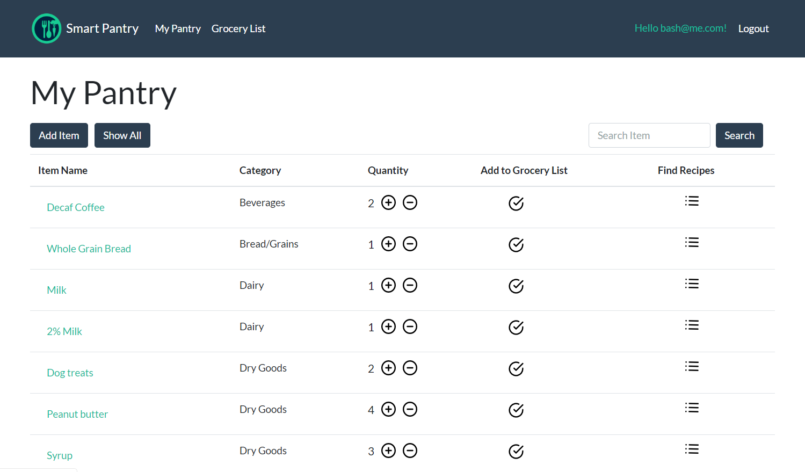
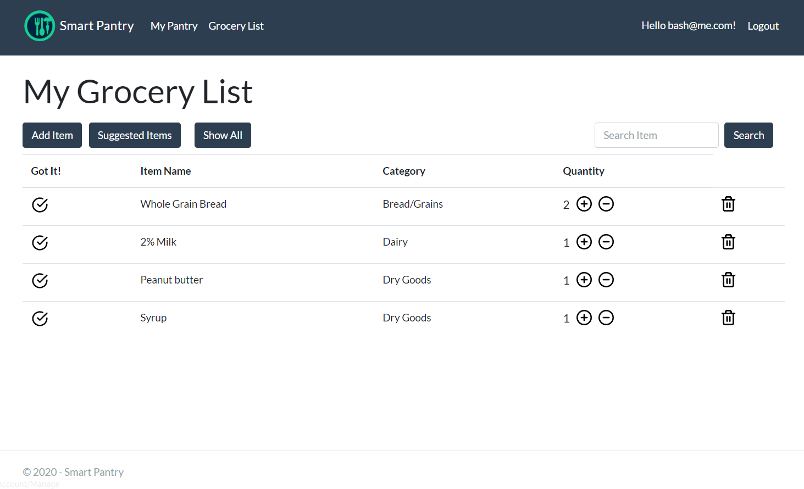
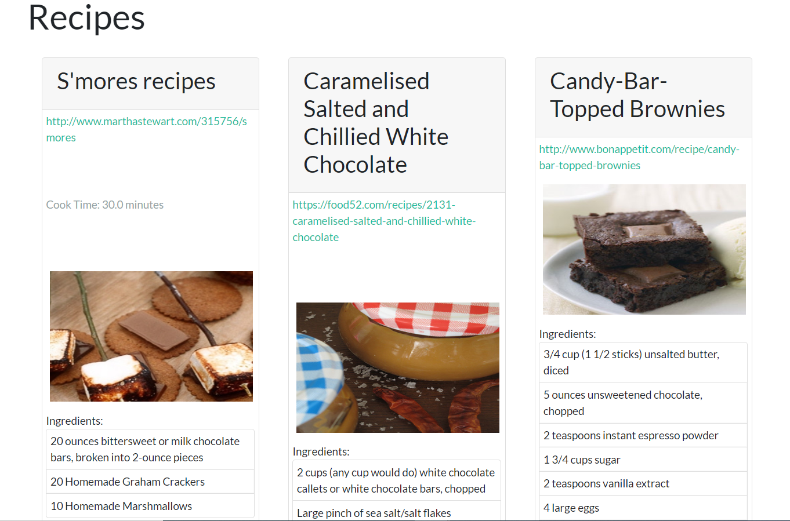

# Smart Pantry

Smart Pantry is an Asp.Net MVC web app with full CRUD functionality that allows users to fluidly manage and track items in their pantry, automatically generate grocery lists, and search for recipes based on selected items from their pantry.  It offers a simple, user-friendly design and takes away the chore of pantry management.  

On the pantry tab, the user is presented with a simple list of all items in their pantry, organized by category.  Users have the ability to add items to their pantry, including item name, quantity, and category.  The user also has the option to add a low quantity alert threshold, which will automatically add the item to the suggested grocery list when the quantity runs low.  Users can edit pantry items, as well as adjust the quantity of the item directly from the main page.  Users can also search their pantry items by name or by category for easy visualization.  Items with a quantity of 0 do not show on the pantry list, but are automatically added to the suggested grocery list.  The user can also add items to their grocery list from the pantry with a single click. 

Each pantry item has a recipe button that allows the user to view recipes that are associated with that pantry item.  The user is presented with a recipe card that includes a link to the recipe, image, cook time, ingredients required, and nutrition information.

On the grocery list tab, the user has the ability to add and delete items, including quantity, and can easily adjust the quantity of list items from the main page.  A "Suggested Items" button shows the user a detailed view of current pantry items that have hit the low quantity alert threshold set by the user, including the current amount in the pantry, or that have a quantity of 0.  The user can choose to add these items to the grocery list or delete the suggested item.  From the grocery list, the user can indicate a purchase of the item with a single click, and the item and quantity purchased are automatically added to the current user's pantry.  

      

## Installation

In your terminal run git clone SSH KEY HERE

Open Visual Studio

Under the tools tab, open the NuGet Package Manager console and run Update-Database to run migrations

Build and run the application after migrations are complete

## Usage
1. Register a new user
2. Navigate to the My Pantry link on the navbar
3. Add a few items to your pantry
4. Click on an item's name to view details and edit item
5. Click on the "Find Recipes" icon of an item to view recipes
6. Adjust the item quantity of at least one item to 0 using the "-" icon
7. Navigate to the Grocery List link
8. Click on the Suggested Items button to view items from pantry that hit the low threshold alert or a quantity of 0
9. Choose to add an item to your grocery list
10. Navigate back to Grocery List and add an item that does not already exist in your pantry
11. Adjust quantity of an item on the grocery list
12. Click the "Got It" icon
13. Navigate back to My Pantry and view the purchased grocery item has been added to the pantry list

